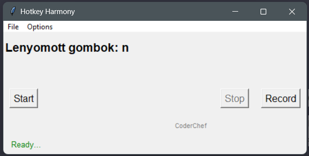

# Hotkey Harmony

The Hotkey Harmony
is a simple Python application designed to record, store, and replay keystrokes. 
It captures keyboard inputs, stores them, and allows users to replay the recorded keystrokes. 
This tool can be useful for various purposes, such as studying user behavior, debugging, or simply keeping a log of keyboard activities.

## Features
 - **Keystroke Logging**: The app records all keystrokes made by the user, including key combinations and special characters.
 - **Secure Storage**: Recorded keystrokes can be exported and imported, but the application does not store them itself, ensuring user privacy and data integrity.
 - **Replay Functionality**: Users can replay the recorded keystrokes, providing a convenient way to review or reproduce a sequence of keyboard inputs.
 - **Customization**: The app allows users to configure settings, such as recording duration, storage location, and replay speed.


## Installation
Clone the repository:

### Prerequisites


 1. Clone the repository:
    ```bash
    git clone https://github.com/CoderChef01/screenrecord.git
    cd keylogger-app
    ```
 2. Set up a virtual environment (optional but recommended):
    ```bash
    python -m venv venv
    source venv/bin/activate  # On Windows, use venv\Scripts\activate
    ```
 3. Install dependencies:
    ```bash
    pip install -r requirements.txt
    ```

### Usage


 1. Run the KeyLogger App:
    ```bash
    python screenrecord.py
    ```
 2. Click to the Record button
 3. Interact with your keyboard as usual.
 4. Stop the recording when desired.
 5. Replay the recorded keystrokes with the Start button


## Contributing
If you want to contribute to this project, follow the steps outlined in the Contributing section of the README.

## Legal Notice
It's important to note that Hotkey Harmony is intended for educational purposes only. As the creator, I take no responsibility for any illegal activities that may be carried out using this tool. I have made the code public for viewing purposes only, and urge you to use it ethically and responsibly.